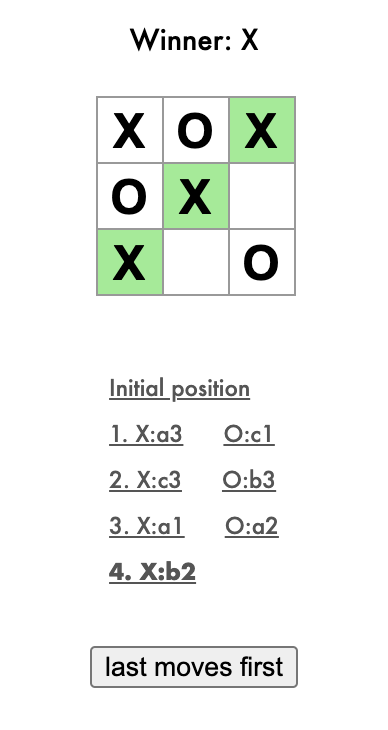

# React tic-tac-toe

This is a follow up from [React.js tic-tac-toe tutorial](https://reactjs.org/tutorial/tutorial.html).

It also implements the challenges given at the end of the tutorial:

> 1. Display the location for each move <strike>in the format (col, row)</strike> in the move history list.
> 2. Bold the currently selected item in the move list.
> 3. Rewrite Board to use two loops to make the squares instead of hardcoding them.
> 4. Add a toggle button that lets you sort the moves in either ascending or descending order.
> 5. When someone wins, highlight the three squares that caused the win.
> 6. When no one wins, display a message about the result being a draw.

The format used in the move history here is the same notation from chess games, that is:
- `a1` for (col 1, row 3)
- `a2` for (col 2, row 3)
- ...
- `c3` for (col 3, row 1)

Print of the resulting app with: a X winner, highlighted winning squares, move list history, and a "last moves first" toggle button:

---

This project was bootstrapped with [Create React App](https://github.com/facebook/create-react-app).

## Available Scripts

In the project directory, you can run:

### `npm start`

Runs the app in the development mode.\
Open [http://localhost:3000](http://localhost:3000) to view it in the browser.

The page will reload if you make edits.\
You will also see any lint errors in the console.

### `npm run build`

Builds the app for production to the `build` folder.\
It correctly bundles React in production mode and optimizes the build for the best performance.

The build is minified and the filenames include the hashes.
